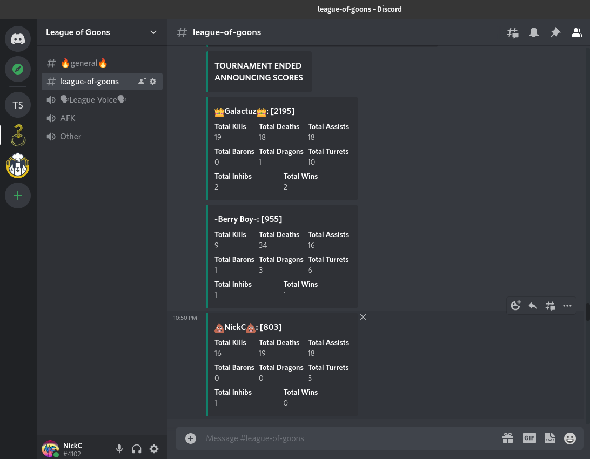
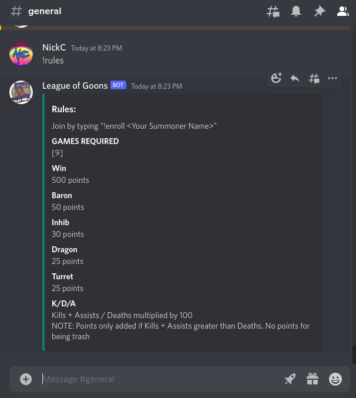

# League Of Goons
#### Discord Bot

#### Host a tournament with your discord friends and see who is the best without actually having to play together.

[Server Setup](#self-host-server-setup)

---

## Usage

The bot works by enrolling your Summoner Name. Use: ***!enroll \<Summoner Name\>***


Play your required games and once **at least 3 people** have completed their games, the tournament will total the points gained in each match. Players are sorted by highest to lowest score.


### Scoring

Send the ***!rules*** command to see the points used for each match played.


### Commands

Use the ***!help*** command to see the list of all commands available.

| Command | Description | Example |
| --- | --- | --- |
| !enroll | Enrolls discord account with Summoner Name | `!enroll LOLTYLER1`
| !enrolled | List all enrolled users | `!enrolled`
| !unenroll | Removes you from the tournament | `!unenroll`
| !help | Shows these commands in a message | `!help`
| !kick | @mention the discord user you would like to kick. Admin use only | `!kick @NickC`
| !rules | How to use bot and explain points | `!rules`

---

## Self host server setup

After cloning in the repository you must save a .env file in the root directory (same location as the Dockerfile) that looks like the following:


```bash
#Discord
LEAGUE_OF_GOONS_SERVER=<ID of the Discord server you want the to work on>
DISCORD_CHANNEL=<Desired Discord Channel ID to post results>
LEAGUE_OF_GOONS_BOT_TOKEN=<Discord Bot API Key>

#League API
LEAGUE_API_KEY=<RIOT GAMES API KEY>
LEAGUE_BASE_URL=https://na1.api.riotgames.com

#Emojis used for winner and loser
CROWN=👑
POOP=💩

#Scoring
NUMBER_OF_MATCHES=3
K_D_A_MULTIPLIER=100
BARON_MULTIPLIER=50
INHIB_MULTIPLIER=30
DRAGON_MULTIPLIER=25
TURRET_MULTIPLIER=25
WINS_POINTS=500
```
You only have to replace where you see the **< >**

#### Docker command
While in the root directory of this repository:
```bash
docker build -t leagueofgoonsbot .
docker run -d --name leaugeofgoonsbot --env-file ./.env leagueofgoonsbot:latest

```